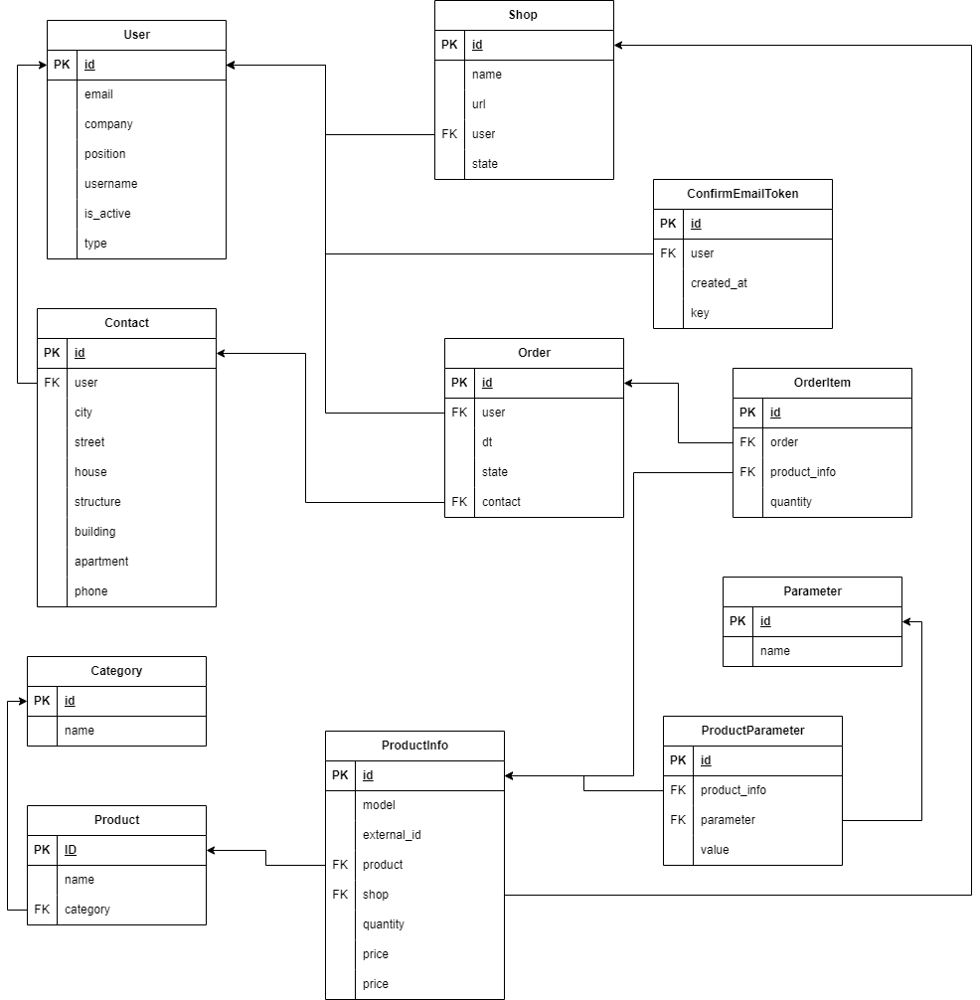

# Дипломный проект профессии «Python-разработчик: расширенный курс»

## Backend-приложение для автоматизации закупок

### Цель дипломного проекта

Создание и настройка проекта по автоматизации закупок в розничной сети, проработка моделей данных, импорт товаров, API views.

## Инструкция к работе над проектом
### Предварительные требования
Перед тем как приступить к запуску проекта, убедитесь, что на вашей системе установлены:

    Docker: для контейнеризации приложений.

    Docker Compose: для оркестрации многоконтейнерных Docker-приложений

### Настройка окружения
Создайте файл .env в корневой директории проекта. Этот файл будет содержать все конфиденциальные настройки и переменные окружения. Пример содержимого файла .env:

## Django settings
    SECRET_KEY=your$ecretKeyWith#And=Symbols
    DEBUG=True or False
    ALLOWED_HOSTS=your_allowed_hosts

## Database settings
    DB_NAME=your_db_name
    DB_USER=your_db_user
    DB_PASSWORD=your_db_password
    DB_HOST=db
    DB_PORT=5432

## Email settings
    EMAIL_BACKEND=django.core.mail.backends.smtp.EmailBackend
    EMAIL_HOST=smtp.mail.com
    # если вы собираетесь использовать TLS-протокол укажите порт 587 если SSL-протокол укажите SSL=TRUE и порт 465.
    EMAIL_PORT=587
    EMAIL_USE_TLS=True
    EMAIL_USE_SSL=False
    EMAIL_HOST_USER=your_email@example.com
    EMAIL_HOST_PASSWORD=your_email_password

## Celery settings
    CELERY_BROKER_URL=redis://redis:6379/0
    CELERY_RESULT_BACKEND=redis://redis:6379/0
    CELERY_TIMEZONE=UTC 

## Sentry settings
    SENTRY_DSN=your_sentry_dsn
    SENTRY_ENVIRONMENT=your_sentry_status
    SENTRY_RELEASE=release_version

## Google settings
    # использовать для добавления гугл авторизации
    GOOGLE_CLIENT_ID=your_google_client_id
    GOOGLE_CLIENT_SECRET=your_google_client_secret

## Запуск проекта

### В корне вашего проекта выполните команду:
    
    docker-compose up --build

Эта команда создаст и запустит необходимые Docker-контейнеры, включая базу данных Postgres, Redis, Django и Celery.

### Примените миграции базы данных:

Убедитесь, что миграции применены, выполнив:

    docker-compose exec django python manage.py migrate

### Создайте суперпользователя:

Для доступа к административной панели Django создайте суперпользователя:

    docker-compose exec django_app python manage.py createsuperuser

### Дополнительные команды

Остановить контейнеры:

        docker-compose down
Перезапустить контейнеры:

    docker-compose restart

Чтобы увидеть логи работающего контейнера Django:

    docker-compose logs django

## Схема базы данных

Tables:

        User, Shop, Product, ProductInfo, ProductParametr, Basket, Order, OrderItem, Category, Parameter, Contact, ConfirmEmailToken

## Структура файла views.py
Для получения подробной информации о views-функциях, смотрите [API_DOCUMENTATION](API_DOCUMENTATION.md)
### User
class RegisterAccount(APIView):
class ConfirmAccount(APIView):
class LoginAccount(APIView):
class ChangeUserType(APIView):
class ContactView(APIView):
class AccountDetails(APIView):
### Partner
class PartnerUpdate(APIView):
class PartnerState(APIView):
class PartnerOrders(APIView):
### Shop
class ShopView(ListAPIView):
class ProductInfoView(APIView):
class BasketView(APIView):
class OrderView(APIView):
class CategoryView(ListAPIView):

## Структура файла signals.py

### def password_reset_token_created
    по пути user/password_reset запрашивает email: your@mail и отправляет токен для смены пароля на почту
    токен смены пароль нужно использовать по пути user/password_reset/confirm 
    передавая: email: your@mail, password: new_passowrd, token: password_reset token

### def new_user_registered_signal
    при выполнении регистрации отправляет письмо с токеном на почту для подтверждения регистрации

### def new_order_signal
    отправляет письмо при обновление статуса заказа
